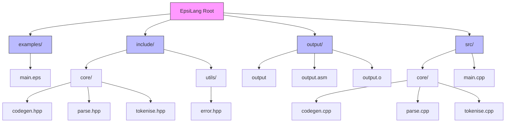

# EpsiLang

EpsiLang is a compiled programming language built from scratch, targeting x86_64 assembly. Currently in early development, it serves as an educational project to understand compiler design and low-level programming concepts.

## Features

- Custom lexer and parser implementation
- Direct x86_64 assembly generation
- Currently, supports basic exit statements
- Zero external dependencies

## Prerequisites

- CMake (3.x or higher)
- C++ compiler with C++20 support
- FASM assembler
- Linux environment (x86_64)

## Building from Source

```bash
# Clone the repository
git clone https://github.com/justanotherdev983/epsilang.git
cd epsilang

# Create build directory
mkdir build && cd build

# Generate build files and compile
cmake ..
make
```

## Running Epsilang programs
1. Create a source file with .eps extension
2. Use the compiler to generate assembly
3. The resulting program will be in the output directory

### Example

```bash
# Compile an EpsiLang source file
./epsilang ../examples/main.eps

# Run the compiled program
../output/output

# Check the exit code
echo $?

```

## Language support
Currently, EpsiLang supports  exit statements and mathematical operations with order precedence:
```code
exit(4+2*3);
```


## Important note
Epsilang is a toy programming language. DONT take it too seriously.